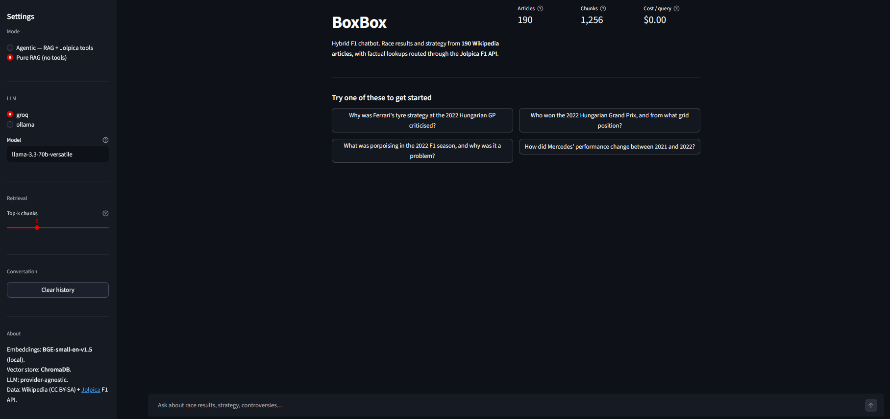
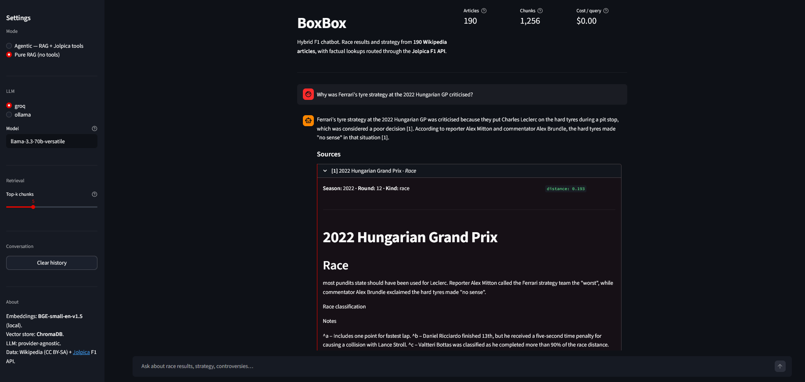
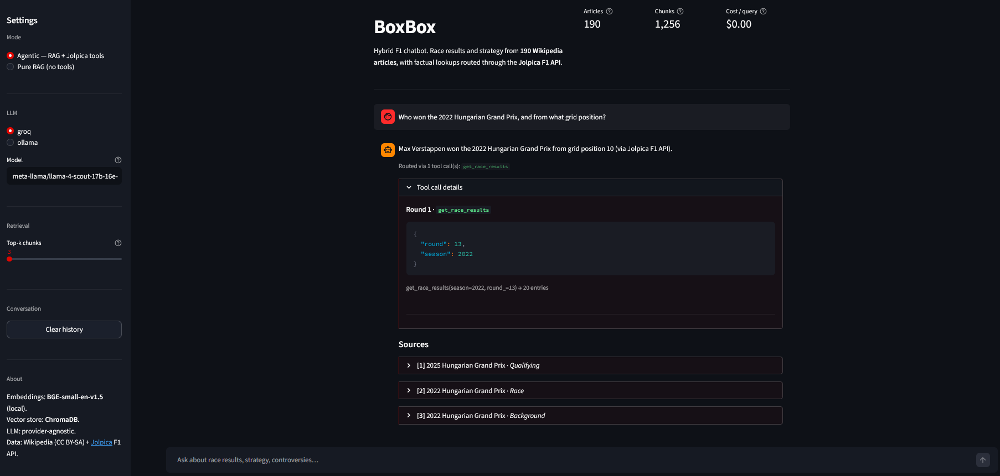

# BoxBox

> In F1 jargon, *"box, box"* is the radio call to bring a car into the pits.
> Apt for a chatbot that boxes each question to the right source —
> Wikipedia narrative for the *why*, the Jolpica F1 API for the *what*.

A hybrid retrieval-augmented chatbot for Formula 1 race history (2018–2025). Ask it conversational questions and it answers with inline Wikipedia citations; ask it factual lookups and it calls the Jolpica F1 API to give you verifiable structured data. The split — **narrative via RAG, facts via tools** — is what makes the answers feel like talking to an F1 historian instead of a clueless autocomplete.



**Status:** self-hostable; runs locally with one command (see [Run it yourself](#run-it-yourself)). The [deploy path](#deploying-to-streamlit-community-cloud) is documented and ready to flip on when there's a reason to make it public.

---

## Walkthrough

### Pure RAG — narrative questions cite Wikipedia inline



The retriever pulls the top-k chunks (BGE-small with asymmetric query encoding) from a Chroma index of Wikipedia F1 articles. The LLM synthesises an answer using only those passages and cites them inline with `[N]` markers; each cited chunk is one expandable card below the answer with a link back to the source article.

### Agentic — factual questions route through the Jolpica F1 API



For factual lookups (winners, qualifying, championship standings), the LLM calls the Jolpica F1 API instead of relying on retrieval. The full tool-call trace — function name, arguments, result summary — is visible right under the answer, so a reviewer can see exactly *how* the system arrived at the number.

---

## The problem

Pure RAG and pure structured lookup each fail on a *different* kind of F1 question:

| Question type | Pure RAG | Pure structured API |
|---|---|---|
| *"Why was Ferrari's strategy at the 2022 Hungarian GP controversial?"* | ✅ Wikipedia narrative is exactly this | ❌ no "controversy" field in the API |
| *"Who won the 2022 Hungarian GP and from what grid position?"* | ❌ embedding similarity drifts; section-level miss within the right article | ✅ exact answer in two structured fields |

The first version of this project did pure RAG and got **hit@k = 0.36** on the gold question set, with most factual questions getting `"I don't have enough information"` even though the right article was in the corpus. The fix was a two-step iteration: a better embedder for retrieval (BGE-v1.5 trained for asymmetric query/passage matching), then an agentic layer that lets the LLM call structured-data tools for factual lookups while keeping passages for narrative.

---

## Architecture

```mermaid
flowchart LR
    subgraph build["Offline: index build"]
        WIKI[Wikipedia<br/>F1 articles<br/>2018–2025]
        SCRAPE[scrape.py<br/>~190 JSON files]
        CHUNK[chunk.py<br/>~1,250 chunks]
        EMBED[embed.py<br/>BGE-small-en-v1.5]
        CHROMA[(ChromaDB<br/>persistent)]
        WIKI --> SCRAPE --> CHUNK --> EMBED --> CHROMA
    end

    subgraph query["Online: query time"]
        Q[User question]
        RETRIEVE[retrieve.py<br/>top-k chunks]
        PIPE{pipeline.py}
        GEN1[generate.py<br/>Llama 3.3 70B via Groq]
        GEN2[generate_with_tools<br/>same model + tool defs]
        TOOLS[tools.py<br/>6 tool fns]
        JOLPICA[Jolpica F1 API]
        ANS[Answer + citations]

        Q --> RETRIEVE
        CHROMA -.cosine.-> RETRIEVE
        RETRIEVE --> PIPE
        PIPE -->|v1: pure RAG| GEN1 --> ANS
        PIPE -->|v2: agentic| GEN2
        GEN2 <--> TOOLS
        TOOLS <--> JOLPICA
        GEN2 --> ANS
    end

    subgraph eval["Offline: eval"]
        GOLD[evals/questions.yaml]
        EVALH[evaluate.py<br/>hit@k, MRR, Ragas]
        REPORT[v1 vs v2 report]
        GOLD --> EVALH --> REPORT
        ANS -.-> EVALH
    end
```

---

## How it works

**1. Scrape.** `scrape.py` walks the Wikipedia season summary pages for 2018–2025 ("YYYY Formula One World Championship"), extracts the list of race-article links from each, and pulls one JSON per race using `wikipedia-api`. Idempotent: re-runs only fetch articles missing from disk. Around 190 articles end up in `data/raw/` (race articles plus 8 season summaries; cancelled races that still have Wikipedia pages — Russia 2022, COVID-cancelled 2020 races — are included).

**2. Chunk.** `chunk.py` splits each article section-first, then slides a token window over long sections. Token sizing uses the *embedding model's own tokenizer* rather than tiktoken — BGE-small has a hard 512-token max and cl100k tokens don't map 1:1 to it. Each chunk gets a context header (`# <race title>\n## <section title>`) prepended so retrieval has clear topical signal. Chunks below 50 tokens of body are dropped as noise.

**3. Embed.** `embed.py` encodes every chunk with `sentence-transformers/BAAI/bge-small-en-v1.5` in one batched `.encode()` call, normalises the vectors for cosine similarity, and upserts into a persistent ChromaDB collection. Cost: $0 (runs locally on CPU). The collection metadata sets `hnsw:space=cosine` to match the normalised vectors.

**4. Retrieve.** `retrieve.py` embeds the user question (with BGE-v1.5's recommended search-instruction prefix — asymmetric query/passage encoding is half the reason this model works on question-shaped queries) and queries Chroma for top-k. Returns typed `RetrievedChunk` objects with the chunk text, structured metadata for citation display, and the cosine distance.

**5a. Generate (v1).** `pipeline.answer` formats retrieved chunks into a numbered context, prompts the LLM to use only those passages and to refuse politely if context is insufficient, and streams the response. The LLM is reached through `generate.py`, a thin provider-agnostic wrapper over Anthropic, OpenAI, Groq, and Ollama — the deploy default is Groq's free tier with Llama 3.3 70B; swapping providers is one env var.

**5b. Agent (v2).** `pipeline.answer_agentic` runs the same retrieval, but in addition exposes six Jolpica F1 API tools (`get_race_results`, `get_qualifying`, `get_driver_standings`, `get_constructor_standings`, `get_race_schedule`, `get_driver_info`) and tells the LLM to prefer tools for factual lookups and passages for narrative. The loop runs up to 5 rounds (initial call → tool → result → maybe another tool → final answer). Every tool call is logged for the writeup.

---

## Results

The eval harness (`scripts/run_eval.py`) scores against a hand-built gold set of question-answer pairs at `evals/questions.yaml`, in five categories: factual, strategy, comparison, multi-race, out-of-scope (refusal-expected).

### Iteration: retrieval quality

| Configuration | Hit@5 | MRR | Refusal rate (out-of-scope) |
|---|---:|---:|---:|
| **v1, MiniLM** (baseline) | 0.36 | 0.26 | 1.00 |
| **v1, BGE-small + asymmetric query prefix** | **0.91** | **0.55** | 1.00 |
| **v2, BGE-small + agentic tools** | _pending — see note below_ | _pending_ | 1.00 |

The MiniLM→BGE swap was triggered by eval results, not vibes: hit@k of 0.36 was bad enough to demand explanation, and per-query diagnostic runs showed the gold article sitting at rank 8 or 21+ for question-shaped queries (where MiniLM's symmetric similarity training underperforms asymmetric query/passage matching). Switching to `BAAI/bge-small-en-v1.5` and applying its recommended `"Represent this sentence for searching relevant passages: "` query prefix lifted hit@k 2.5x with no other change.

> The v2 (agentic) row is pending a full re-run; the comparison was budget-limited on Groq's free tier the day of writing (100K TPD on Llama 3.3 70B). Single-question smoke tests confirm v2 correctly calls `get_race_results` / `get_qualifying` on factual questions that v1 refused. Numbers go here once the run completes.

### Where v1 still fails

Three representative failures, with hypotheses:

**F1 (factual)**: *"Who won the 2022 Hungarian Grand Prix, and from what grid position did he start?"*
- v1 with BGE retrieves the right article at rank 2, but the chunk is from the "Aftermath" section instead of "Race". Hit@k = 1; MRR = 0.5; the LLM still refuses because the retrieved section doesn't contain the winner.
- **Hypothesis:** section-level miss within an article-level hit. The article-level metric hides this.
- **Fix:** a cross-encoder re-ranker (retrieve top-20, re-score with `cross-encoder/ms-marco-MiniLM-L-6-v2`, keep top-5) — promotes the section with the actual answer.
- v2 sidesteps this entirely: the LLM calls `get_race_results(2022, 13)` and gets the structured answer.

**C2 (comparison)**: *"How close were Max Verstappen and Lewis Hamilton in the 2021 Drivers' Championship?"*
- Neither the 2021 season summary nor the 2021 Abu Dhabi GP article makes top-5. Hit@k = 0.
- **Hypothesis:** BGE-small ranks chunks that lexically discuss "championship margin" or "points gap" mid-season higher than the final-race chunk that actually answers the question.
- **Fix:** metadata pre-filter on `{"season": 2021, "kind": "season"}` for queries that mention "championship" + a year, or v2 routing to `get_driver_standings(2021)`.

**S2 (strategy)**: *"What was 'porpoising' in the 2022 F1 season, and why was it a problem?"*
- Retrieval pulls one porpoising-tangential chunk (about DRS zones at the 2022 Australian GP) but misses the 2022 season summary's main porpoising section. Hit@k = 0.
- **Hypothesis:** The season summary's porpoising section uses dense technical prose that doesn't lexically resemble "porpoising problem" framing.
- **Fix:** also probably the cross-encoder re-ranker, with a stretch goal of multi-vector retrieval (encode by paragraph rather than ~480-token windows, so the porpoising-specific paragraph isn't averaged into a longer chunk).

---

## What I'd do next

In rough order of impact:

- **Cross-encoder re-ranker** for retrieval. Retrieve top-20 with BGE, re-score with a stronger encoder, keep top-5. Closes most of the remaining MRR gap.
- **Hybrid retrieval (BM25 + dense)** for queries with literal entity matches (driver names, circuit names, exact phrases). Dense embedding alone fumbles literal matches sometimes.
- **Metadata-aware retrieval** — extract entities (year, race, driver) from the question with a tiny LLM call, then pre-filter Chroma `where={...}` before scoring. Especially helps year-drift problems.
- **2026+ races as the season progresses.** The scraper is idempotent; an incremental rebuild is a few minutes per session.
- **FIA stewards' decisions corpus** — a separate document type for race-incident penalties, queryable alongside Wikipedia narrative. Would let the bot answer "why was Verstappen penalised at race X" with a source that's actually authoritative.
- **Multi-turn conversation memory** in the Streamlit UI — currently each turn is independent.
- **Streamlit UI toggle for agentic mode** — the eval harness exposes it; the UI doesn't yet.

---

## Run it yourself

```bash
# 1. Install uv (one-time)
# Windows:   winget install --id=astral-sh.uv -e
# macOS/Linux: curl -LsSf https://astral.sh/uv/install.sh | sh

# 2. Clone and sync
git clone https://github.com/<your-github>/f1-rag.git
cd f1-rag
uv sync --extra ui --group dev

# 3. Set GROQ_API_KEY (free tier — sign up at https://console.groq.com)
cp .env.example .env
# Edit .env and set: GROQ_API_KEY=gsk_...

# 4a. Use the pre-built index (shipped in the repo) — instant
uv run streamlit run app/streamlit_app.py

# 4b. OR rebuild from scratch (~10 minutes — scrape + embed)
uv run python -m f1_rag.scrape --start-year 2018 --end-year 2025
uv run python scripts/build_index.py --mode rebuild
uv run streamlit run app/streamlit_app.py
```

To run the eval harness:
```bash
uv sync --group eval
uv run python scripts/run_eval.py --compare --no-ragas
```

To run fully offline with Ollama instead of Groq:
```bash
# Install Ollama (https://ollama.com), then:
ollama pull llama3.2:3b
# Set in .env: LLM_PROVIDER=ollama
uv run streamlit run app/streamlit_app.py
```

---

## Deploying to Streamlit Community Cloud

1. Push the repo to GitHub (the pre-built `chroma_db/` directory must be committed so the cloud instance doesn't try to rebuild on cold start).
2. Go to [share.streamlit.io](https://share.streamlit.io) and click **New app**.
3. Configure:
   - **Repository:** `<your-github>/f1-rag`
   - **Branch:** `main`
   - **Main file path:** `app/streamlit_app.py`
   - **Python version:** 3.11 (set via the dropdown or `runtime.txt`)
4. Click **Advanced settings** → **Secrets** and paste:
   ```toml
   GROQ_API_KEY = "gsk_your_key_here"
   ```
5. Click **Deploy**.

**Cold-start expectations:** first boot downloads `sentence-transformers` + `torch` + the BGE-small model (~700 MB), which takes 1–2 minutes. Subsequent users hit a warm instance and see <1s first-token latency. After ~20 min of inactivity Streamlit Cloud puts the app to sleep; the next visitor pays the cold-start tax once.

**Memory footprint:** ~700–900 MB at steady state. Tight on the 1 GB free tier but works in practice. If you ever switch to BGE-base (~440 MB model), measure carefully — it's likely too much for the free tier.

**Rate limits:** Groq's free tier is 100K tokens/day for Llama 3.3 70B. At portfolio traffic that's plenty; for a viral moment, upgrade to Groq Dev tier or rotate to a paid Anthropic key (set `ANTHROPIC_API_KEY` and `LLM_PROVIDER=anthropic`).

---

## Tech stack

| Layer | Choice | Why |
|---|---|---|
| Embeddings | `BAAI/bge-small-en-v1.5` | Asymmetric query/passage training. 130 MB, CPU-friendly, fits Streamlit Cloud. |
| Vector store | ChromaDB (persistent) | Local-first, no server to manage, persistent across restarts. |
| LLM (deploy) | Llama 3.3 70B via Groq | Free tier, very fast streaming, OpenAI-compatible API. |
| LLM abstraction | `generate.py` | One function fans out to Groq / OpenAI / Anthropic / Ollama — swap providers via env var. |
| UI | Streamlit | Chat UI + sidebar in ~100 lines, deploys for free. |
| Config | `pydantic-settings` | Typed `Settings` with `.env` loading and per-field defaults. |
| Schemas | Pydantic v2 throughout | One source of truth for shapes (chunks, retrieved chunks, citations, agentic answers, tool calls). |
| Eval | Ragas + hand-rolled hit@k / MRR / refusal-phrase detection | Ragas for LLM-as-judge metrics, custom for retrieval since the failure modes are easier to reason about transparently. |
| Tokenization (chunk sizing) | The embedding model's own tokenizer | Avoids silent truncation at the 512-token BGE max. |
| Package mgmt | `uv` + `pyproject.toml` (PEP 735 dep groups for eval / dev) | Fast installs, reproducible lockfile, isolation of heavy eval deps from the deploy. |

---

## Acknowledgements

- **[Jolpica F1](https://jolpi.ca/)** — the community-run successor to the Ergast Motor Racing Developer API. Ergast was deprecated at the end of 2024; this project migrated to Jolpica's drop-in replacement, which serves the same JSON schema at `https://api.jolpi.ca/ergast/f1/`.
- **[FastF1](https://docs.fastf1.dev/)** — Python library for live F1 telemetry and timing data. Out of scope for this version (we work with race history, not live sessions), but it would be the obvious foundation for a live-race extension.
- **Wikipedia** — race articles released under [CC BY-SA 4.0](https://creativecommons.org/licenses/by-sa/4.0/). When you cite a chunk in the app, the link goes back to the original article.
- **[Ragas](https://docs.ragas.io/)** — open-source RAG evaluation framework. Used for faithfulness / answer-relevancy / context-precision / context-recall metrics.
- **[BAAI BGE](https://huggingface.co/BAAI/bge-small-en-v1.5)** — open embedding models.

---

## License

MIT — see [LICENSE](LICENSE).
